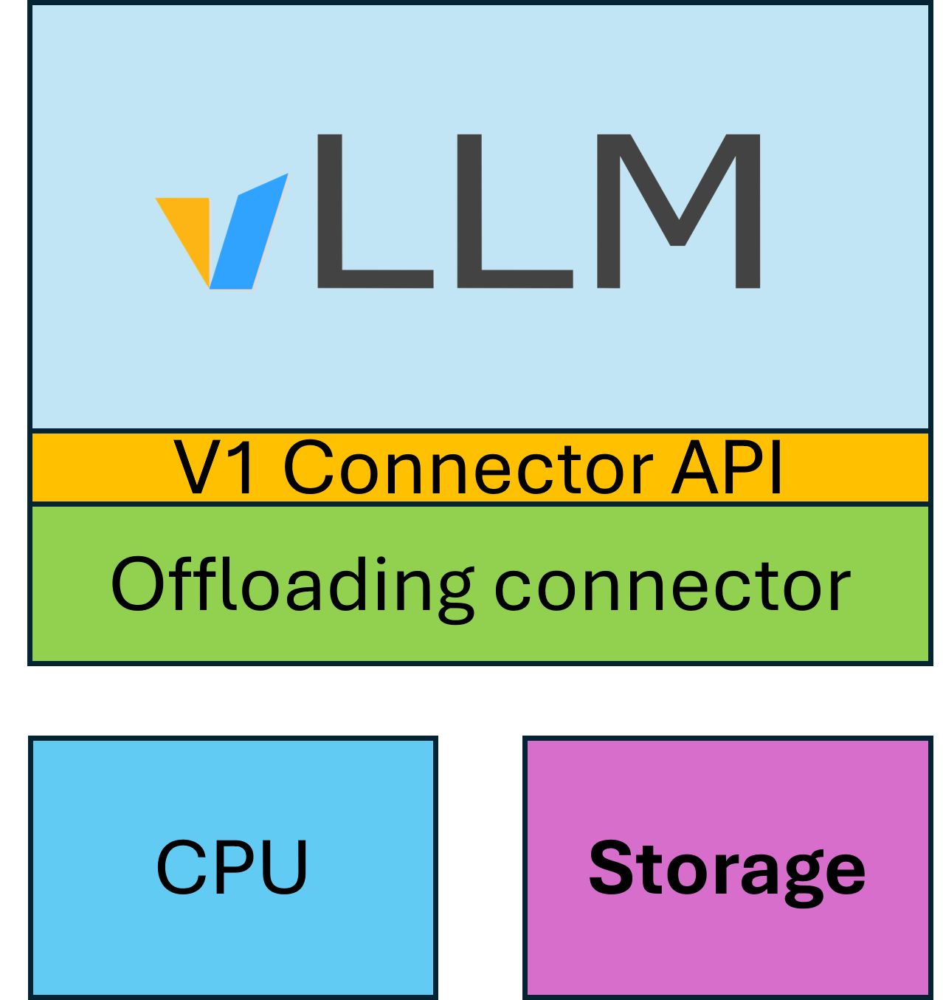

# llmd-fs-backend README

## Overview

The llmd-fs-backend extends the native [vLLM Offloading Connector](#offloading-connector-docs) to support a file system backend.
This backend provides a shared-storage offloading layer for vLLM. It moves KV-cache blocks between GPU and shared storage efficiently using:

- GPU block transfers using GPU DMA (default) or optional GPU-kernel-based copying using GPU SMs.
- Thread-local pinned staging buffers
- Multiple I/O worker threads
- NUMA-aware CPU scheduling of worker threads
- Atomic file writes and reads

The fs connector (an offloading connector with a file system backend) is suitable for shared storage, as well as a local disk.

For architectural clarity, the fs backend is not responsible for cleanup. It is up to the storage system to manage this.
For simple setups, see the **Storage Cleanup** section.



## System Requirements

- vLLM version 0.12.0 or above.

## Installation

### 1. Install from a pre-built wheel (Recommended)

```bash
pip install https://raw.githubusercontent.com/llm-d-kv-cache-manager/kv_connectors/llmd_fs_backend/wheels/llmd_fs_connector-0.0.1-cp312-cp312-linux_x86_64.whl
```

This installs:

* Python module `llmd_fs_backend`
* CUDA extension `storage_offload.so`

### 2. Build from source (compile yourself)

Requires CUDA toolkit and system dependencies.

```bash
apt-get update && apt-get install -y libnuma-dev git cuda-toolkit-12-9
pip install git+https://github.com/llm-d-kv-cache-manager.git#subdirectory=kv_connectors/llmd_fs_backend
```

### 3. Developer mode (clone and editable install)

Clone the source and install in editable mode:

```bash
apt-get update && apt-get install -y libnuma-dev git cuda-toolkit-12-9
git clone https://github.com/llm-d-kv-cache-manager.git
cd llm-d-kv-cache-manager/kv_connectors/llmd_fs_backend
pip install -e .
```

## Configuration Flags

### Connector parameters

- `shared_storage_path`: base path for storing and loading the KV data files.
- `block_size`: number of tokens stored per file (must be in granulaity of GPU block size).
- `threads_per_gpu`: number of I/O threads per GPU
- `max_staging_memory_gb`: total staging memory limit

### Environment variables
- `STORAGE_CONNECTOR_DEBUG`: enable debug logs
- `USE_KERNEL_COPY_WRITE` : enable GPU-kernel-based writes using GPU SMs (default 0 - uses DMA copy).
- `USE_KERNEL_COPY_READ`: enable GPU-kernel-based reads using GPU SMs (default 0 - uses DMA copy).

## Example vLLM YAML

To load the fs backend:

```yaml
--kv-transfer-config '{
  "kv_connector": "OffloadingConnector",
  "kv_role": "kv_both",
  "kv_connector_extra_config": {
    "spec_name": "SharedStorageOffloadingSpec",
    "spec_module_path": "llmd_fs_backend.spec",
    "shared_storage_path": "/mnt/files-storage/kv-cache/",
    "block_size": 256,
    "threads_per_gpu": "64"
  }
}'
--distributed_executor_backend "mp"
```

It is recommended to use multiprocess mode by setting:
`--distributed_executor_backend "mp"`

To configure environment variables:

```yaml
env:
- name: STORAGE_CONNECTOR_DEBUG
  value: "1"
```

### K8s Deployment Example

A full K8s deployment example can be found in the [`docs`](./docs/deployment) folder.

Before applying the YAML, create the HF token secret:

```bash
export HF_TOKEN=<HF_TOKEN>
kubectl create secret generic hf-token --from-literal=HF_TOKEN="$HF_TOKEN"
```

This example also creates the required PVCs (using CephFS):

```bash
kubectl apply -f ./docs/deployment/pvc.yaml
```

Then apply the full vLLM deployment (including the offloading connector with a file system backend installation inside the pod):

```bash
kubectl apply -f ./docs/deployment/vllm-storage.yaml
```

## Storage Cleanup

TBD

## Troubleshooting

### Missing `numa.h`
Install the required package:

```bash
apt-get install -y libnuma-dev
```

---

## Link Aliases

- **Offloading Connector Docs**
  <a name="offloading-connector-docs"></a>
  https://docs.vllm.ai/en/stable/features/disagg_prefill/#usage-example:~:text=backends%22%3A%5B%22UCX%22%2C%20%22GDS%22%5D%7D%7D%27-,OffloadingConnector,-%3A%20enable%20offloading%20of
